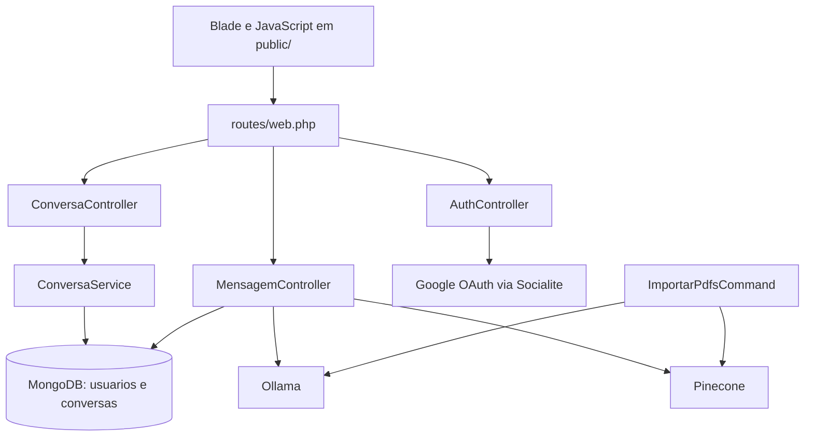

# Arquitetura atual

## Visão geral

O sistema é uma aplicação Laravel monolítica. O navegador recebe páginas Blade e executa JavaScript estático de `public/`. As requisições do chat usam endpoints definidos em `routes/web.php`, que encaminham para controllers em `app/Http/Controllers/`.

## Fluxos principais

### Entrada e autenticação

1. `/` renderiza `welcome`.
2. `/auth/redirect` chama `AuthController@login()`, que inicia o fluxo Google com Socialite.
3. `/auth/callback` chama `AuthController@callback()`, procura `Usuario` por `google_id`, cria ou atualiza o usuário e autentica a sessão.
4. Usuários autenticados acessam `/gear` e as rotas protegidas por middleware `auth`.
5. `/guest` encerra a sessão, se houver, e redireciona para `/chat`.

### Chat e recuperação de contexto

1. `public/js/script.js` envia `POST /perguntar` com a pergunta e o histórico.
2. `MensagemController@perguntar()` solicita um embedding ao Ollama em `/api/embed`.
3. O vetor é consultado no Pinecone em `/query`; os textos de `matches[*].metadata.text` formam o contexto.
4. O controller chama o endpoint compatível com OpenAI do Ollama em `/v1/chat/completions`.
5. A resposta JSON é interpretada pelo JavaScript e exibida no DOM.
6. Quando há conversa ativa, o frontend envia pergunta e resposta para `POST /mensagens/store`.

### Ingestão de PDFs

`app/Console/Commands/ImportarPdfsCommand.php` implementa `app:importar-pdfs {abnt.pdf}`. O comando lê o PDF, divide o texto em blocos de 1000 caracteres, gera embeddings no Ollama e envia vetores com metadados `text`, `source` e `chunk_index` ao Pinecone em `/vectors/upsert`.

## Persistência e fronteiras

- `Usuario` e `Conversa` usam a conexão `mongodb` explicitamente.
- `Conversa` usa a coleção `conversas` e a relação `embedsMany(Mensagem::class)`.
- `Mensagem` é um modelo MongoDB, mas não declara uma conexão própria.
- `config/database.php` define SQLite como conexão padrão por fallback e também declara MongoDB.
- As migrações presentes criam estruturas relacionais para usuários, mensagens, cache, jobs e sessões. Não foi encontrada migração para as coleções MongoDB `usuarios` e `conversas`.

**Status: não determinado:** o banco efetivamente usado em cada ambiente, a execução das migrações e a existência de configuração externa complementar.

## Inconsistências observáveis

- `routes/web.php` registra `ConversaController@storebtn` e `ConversaController@show`, mas esses métodos não estão no controller atual.
- A rota `DELETE /mensagens/{id}` aponta para `MensagemController@destroy`, método não presente no controller atual.
- `routes/web.php` importa `App\Http\Models\Mensagem`, enquanto o modelo analisado está em `App\Models\Mensagem`.
- Há diferença entre o desenho relacional das migrações de mensagens e o relacionamento embutido MongoDB de `Conversa`.
- `MensagemController` e `ImportarPdfsCommand` leem `services.ollama`, enquanto as configurações relacionadas ao Ollama estão separadas em outro arquivo de configuração; `services.php` não define a chave `ollama` observada.

## Informações não determinadas

Não é possível determinar apenas pelo código analisado: valores de credenciais, URLs finais, disponibilidade dos serviços externos, quais rotas inconsistentes são chamadas por clientes e se o bundle Vite é usado em produção.
